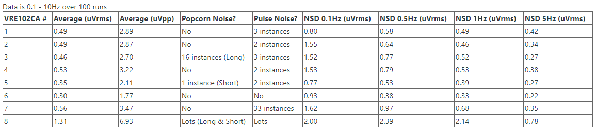

# Nuts

An assortment of data and observations regarding electronics metrology and precision analog electronics.

## Charts table of contents
[ADR1399 output voltage deviation vs. heater voltage](#adr1399-output-voltage-deviation-vs-heater-voltage)  
[ADR1399 output voltage noise vs. reference current](#adr1399-output-voltage-noise-vs-reference-current)  
[ADR1399 unheated tempco](#adr1399-unheated-tempco)  
[VRE102CA voltage reference noise in batch of 8](#vre102ca-voltage-reference-noise-in-batch-of-8)  
[LTZ1000 unheated TC](#ltz1000-unheated-tc)  
[Solartron 7081 warmup with 10V input, comparison of 2 firmwares](#solartron-7081-warmup-with-10v-input-comparison-of-2-firmwares)  
[Solartron 7081 linearity](#solartron-7081-linearity)  
[Keithley DMM6500 linearity](#keithley-dmm6500-linearity)  
[Keithley DMM6500 leakage](#keithley-dmm6500-leakage)  
[MOSFET Idss leakage with 0V gate at 21°C](#mosfet-idss-leakage-with-0v-gate-at-21c)  
[OPA140 CMRR](#opa140-cmrr)  
[LT3042 & LT3093 low frequency noise](#lt3042--lt3093-low-frequency-noise)  
[G3VM-41GR6 SSR off-leakage](#g3vm-41gr6-ssr-off-leakage)

## Schematics table of contents
[Feedforward bootstrap](#feedforward-bootstrap)

## Charts
### ADR1399 output voltage deviation vs. heater voltage

The ADR1399 datasheet discusses the improved output dynamic impedance for reducing the change of output voltage vs. zener supply current. What about the heater supply voltage?

With heater+ at 15V, and heater- swept from 0V to -15V (to give 15-30V heater voltage range), output voltage coefficient is 0.37 ppm/V. Heater+ is fixed at 15V as this also supplies the zener current (through 2.35k Rshunt).

### ADR1399 output voltage noise vs. reference current

It is known that the internal schematic of LM399 means that as long as a minimum current condition is met, there should not be any change in output voltage noise for higher currents as the actual zener current is fixed. This is confirmation that the ADR1399 is the same. 1mA is below the allowable range of reference current, it is shown here as a point of interest.

### ADR1399 unheated tempco

7.8 PPM/degC, linear for 15 to 29 degC range.

Data from eevblog shows that for the LM399, the unheated tempco does vary significantly from device to device so this measurement of one ADR1399 is mainly for curiosity as it's likely to have similar behaviour.

### VRE102CA voltage reference noise in batch of 8

Powered from +/-14V supply, with positive reference output going into 0.1 - 10Hz LNA.

### LTZ1000 unheated TC

Uncorrected TC of LTZ1000 = 33-37 PPM/C.
Corrected TC with 17 ohm resistor = around 0 PPM/C.

Top line in each series is the heat up (using internal heater), bottom line is the cool down.

### Solartron 7081 warmup with 10V input, comparison of 2 firmwares

MickleT has provided a modified Solartron 7081 firmware which resolves an issue with post-mux switching dwell time, to allow internal circuits to settle before taking zero reading.

### Solartron 7081 linearity

Using Marco Reps' Fluke calibrator and 3458A to test INL of S7081.

### Keithley DMM6500 linearity

DMM6500 set to 1NPLC, high impedance input, autozero enabled.
Per step; 80 seconds to allow the PWM DAC output to settle, approximately 1 minute of samples acquired and averaged to give a single value for the chart.

### Keithley DMM6500 leakage

Connected a lead from the PE screw on the rear panel, to the current input, digitize mode with 100uA range. 140nApp. Lead is unplugged halfway through the trace.

### MOSFET Idss leakage with 0V gate at 21°C

Using Keithley 617 electrometer, with +/-100V DAC output, to sweep the drain pin of MOSFETs from 0.1V to maxV, gate pin and source pin shorted together and wired into electrometer input. FOM is (10V/(datasheet RDS))/(leakage at 10V) to provide a quick comparison point.

### OPA140 CMRR

OPA140 configured as unity gain buffer. DMM measuring input-to-output. Measured CMRR = 142dB.

### LT3042 & LT3093 low frequency noise
 
 22uF Cset. Datasheet hides the 0.1-10 Hz region for good reason...
 

### G3VM-41GR6 SSR off-leakage

Using Keithley 617 electrometer, with +/-100V DAC output, to sweep a pin of the SSR from 0.1V to 40V. Other pin wired to electrometer input.

## Schematics
### Feedforward bootstrap

Improves CMRR and other similar effects.

