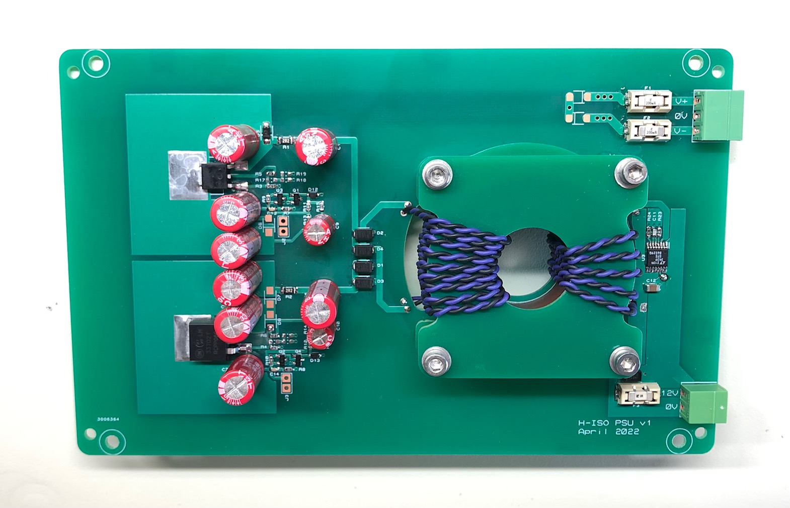
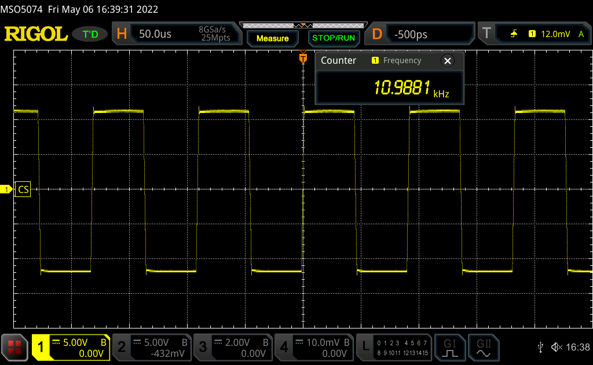
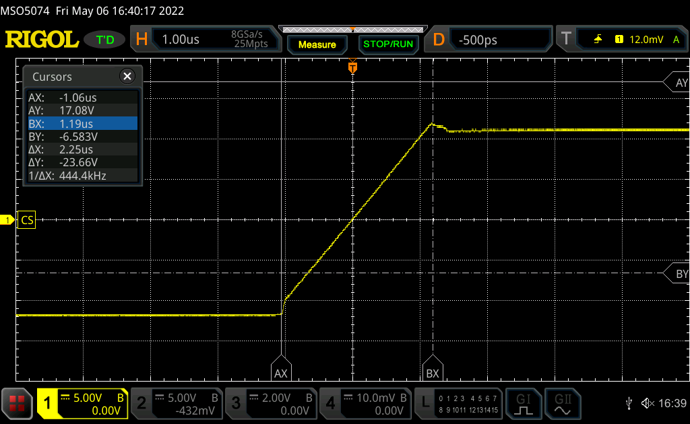
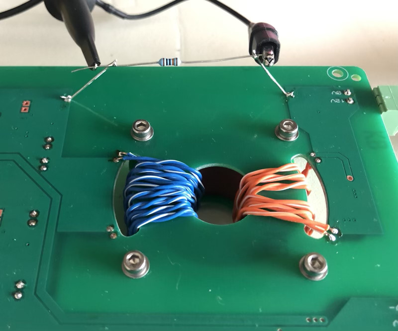
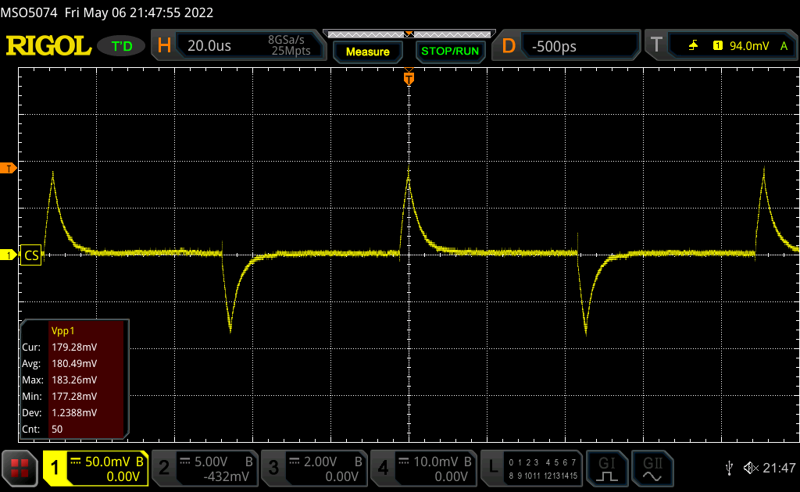
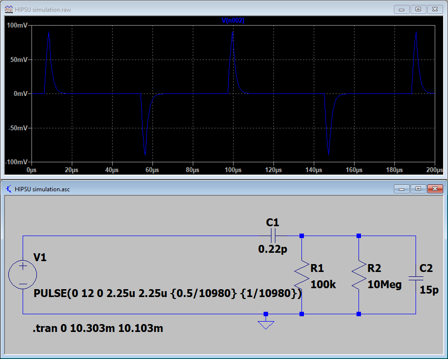
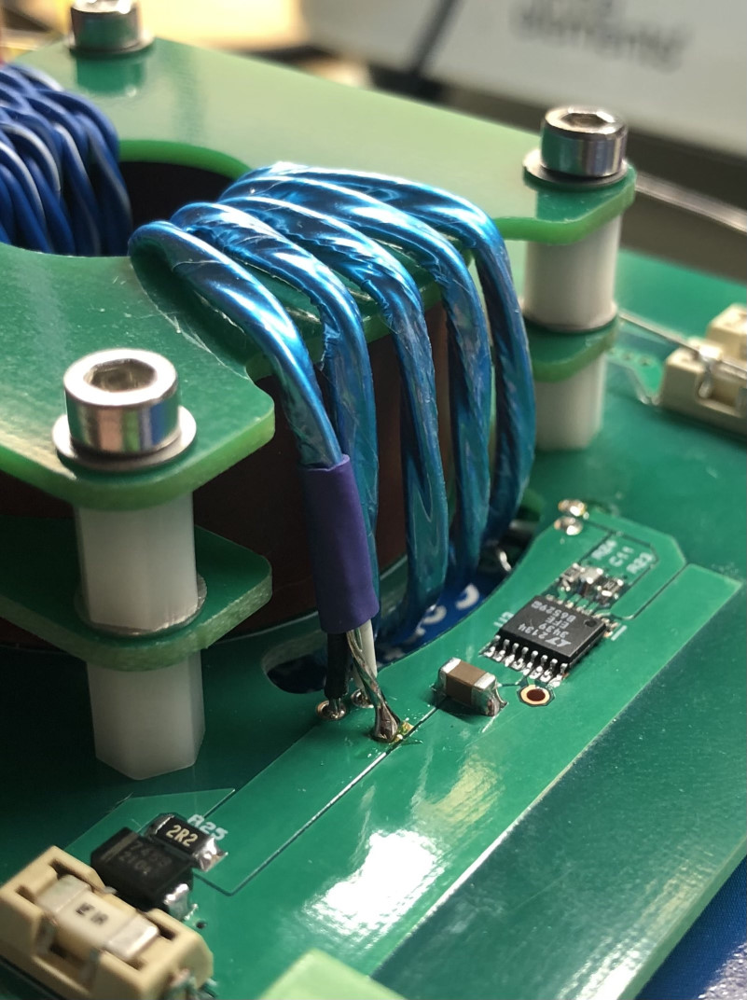
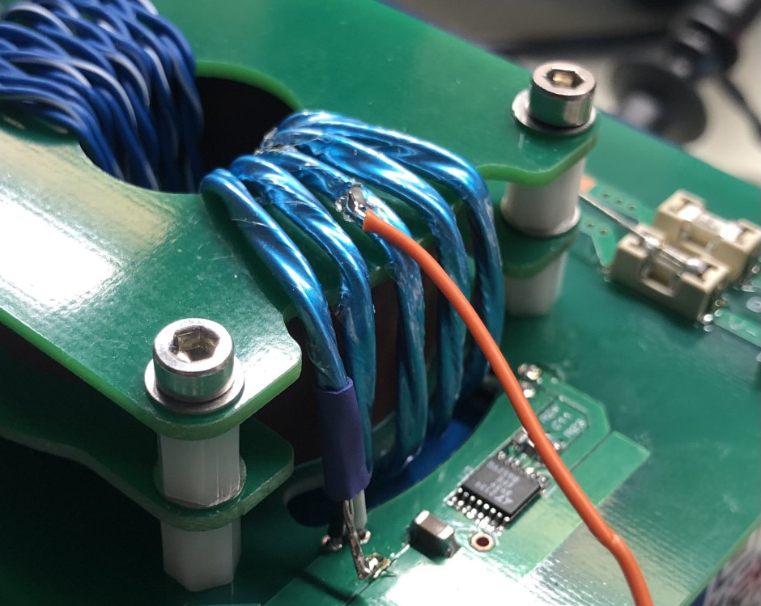

# High isolation PSU

12V input, +/-15V (adjustable with component choice) 100mA output.

## Primary-secondary capacitance

PCB using LT3439 and custom wound transformer with bifilar winding and air gap from winding to core. Estimated effective coupling capacitance is 0.22pF, the following describes the process of deducing this.

Looking at one side of the primary drive waveform, it can be seen that primary frequency is 21.96kHz, shown as 10.98kHz due to push-pull configuration:

Looking at the rise time of the primary drive waveform, it is around 2.25uS:

Placing 100k resistor from primary 0V to secondary 0V over most direct route between power planes on the bottom of the PCB (but a good distance away from transformer), and using 10x scope probe, voltage over 100k resistor is about 180mVpp:

Now setting up a simulation that approximately reproduces this scenario using 0.22pF coupling capacitance:

## Further observations & experiments

- Changing from pri:sec 6:9 to 5:9 ratio = 180mVpp (no change) and 1.2x increase in quiescient current (86mA) (both are as-expected & good). Rectified secondary voltage = 20.8V no-load (slight load from LDOs).
- Slight load from LDOs? Positive; 29.3mV over 2.300 ohms = 12.7mA. Negative; 29.1mV over 2.315 ohms = 12.6mA. With input at 12V (86mA) & secondary at 20.8V (12.7mA/12.6mA), that's 1.03W in, 0.53W out, for 51% efficiency (input supply to secondary, not including output LDOs) with no output load.

## Shielded primary

- Twisted pair no shield = 180mVpp
- Twisted pair with shield, connected one end to 0V = 1.9Vpp
- Twisted pair with shield, connected one end to post-input-filter 12V = 2.27Vpp
- Twisted pair with shield not connected to anything = 180mVpp

Adding a shield on the primary was not effective.

## Middle shield tap

- Twisteed pair with middle 0V shield tap = 600mVpp

## Full load testing

- 150 ohm resistors on +/-15V LDO outputs = 100mA on each output.
- Input-to-post-bridge-output on secondary (18.68V, a drop from 20.8V no-load) (i.e. excluding LDO), 76% efficient. (5.5W input, 4.2W output)
- End-to-end, 55% efficient. (5.5W input, 3W output) (Contributing factors to worse efficiency - voltage drop over LDO, and LDO quiescent current of 12.7mA)
