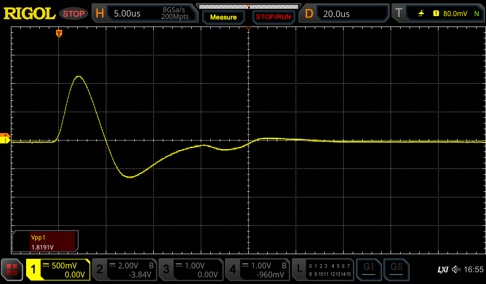
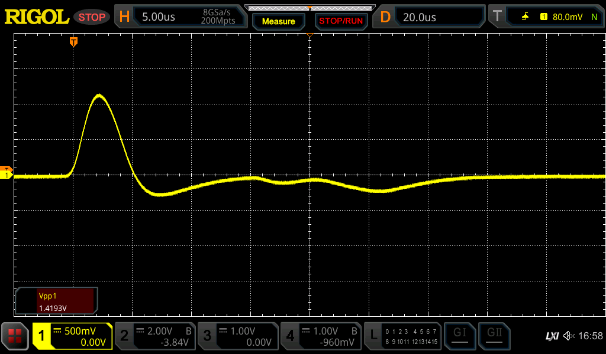
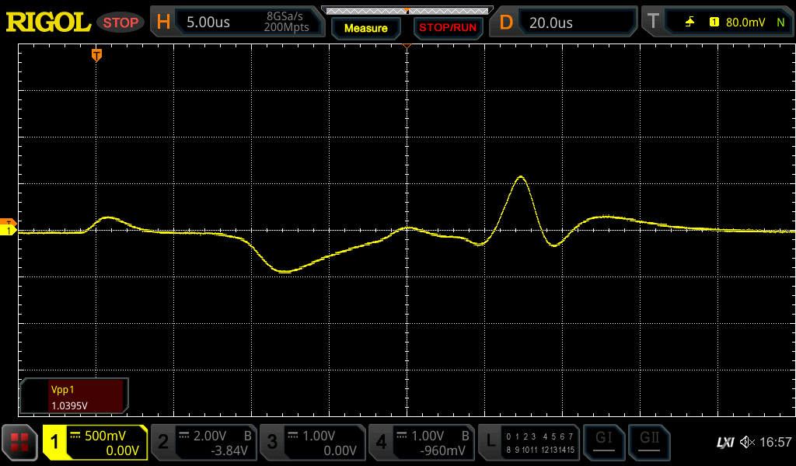
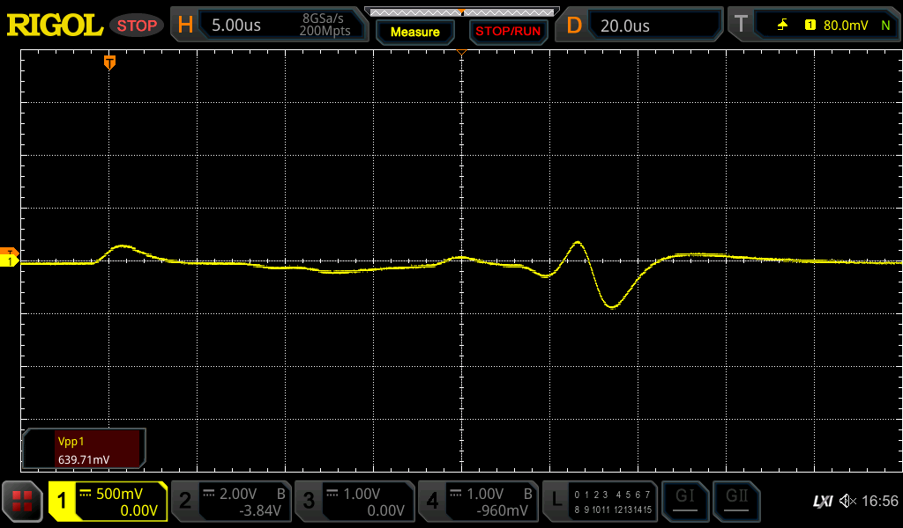
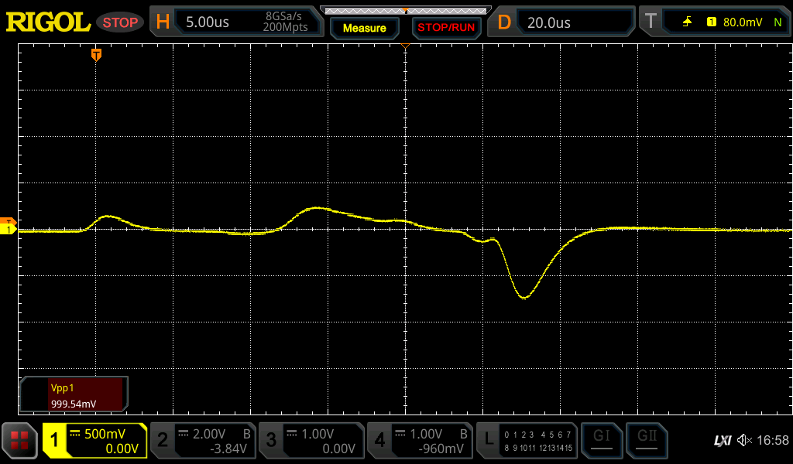

# 3458A input charge injection

Keithley 428 (K428) current amplifier input wired to 3458A input, 1E06 V/A range. K428 output connected to MSO5074.

K428 voltage bias set to 5V/0V/-5V to observe change in charge injection. AZ period start Ipp is in the range of 2.14uApp to 1.42uApp, AZ period end Ipp is in the range of 1.04uApp to 0.64uApp.

There is a charge injection pulse at the start and end of the AZ period. I have made the assumption that they mark the beginning/end of the AZ period, rather than the input measurement period, because of the spacing of the pulses. For a 10 NPLC configuration, there are pulses at 0PLC (large), 10PLC (small), 21PLC (large), 31PLC (small). Note the additional 1PLC that is the meter waiting for the start of the next PLC before doing a new acquisition, it is my opinion that it is more likely the meter idles in the input measurement phase rather than the AZ phase so I am confident in labelling the larger pulses as "AZ period start".

(Large pulse)(10 NPLC zero)(Small pulse)(10 NPLC input)(1 NPLC delay)... and repeat.

## AZ period start

### 5V

### 0V

### -5V

## AZ period end

### 5V

### 0V

### -5V

