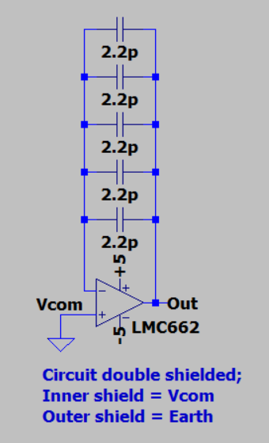
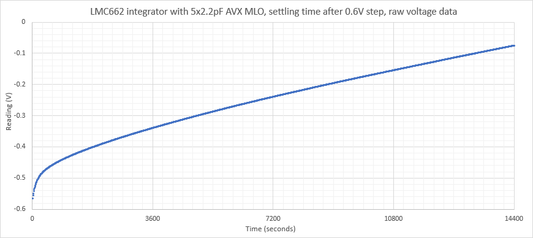
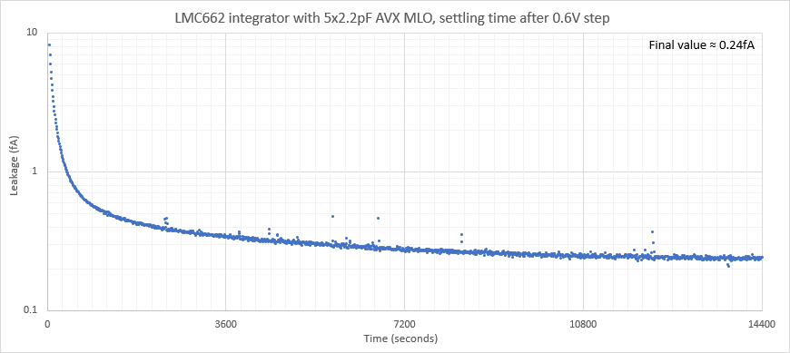
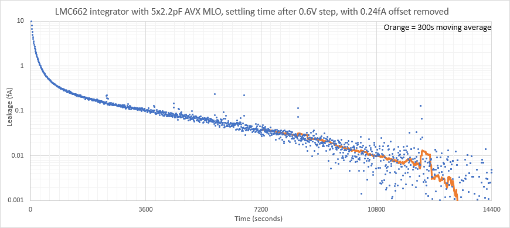

# LMC662 integrator with AVX MLO capacitors

The purpose is to test the settling time of LMC662 + AVX MLO combination as an integrating electrometer. Upon powering the LMC662, a 0.6V offset appears on the LM662 output (perhaps non-symmetrical power ramp up biasing through ESD diodes?) which is a useful feature for the purposes of this experiment. 

Circuit is mounted on protoboard, and is doubly shielded; inner shield at Vcom and outer shield (a steel cabinet) at earth. LMC662 input pin is lifted from board & air wiring used to minimise leakage.

After 24 hours at 0V, the circuit is powered up causing a 0.6V step change over the feedback capacitors, the integrator output is then measured for the next 4 hours.

Schematic:

Raw data from DMM6500 (1V range, 1NPLC, autozero on & filter enabled to generate 1 sample every 10.2 seconds):

Calculated current:

It can be seen that the final leakage (LMC662 input bias + other unknown leakage sources) is around 0.24fA. This offset is removed and a new plot generated:

