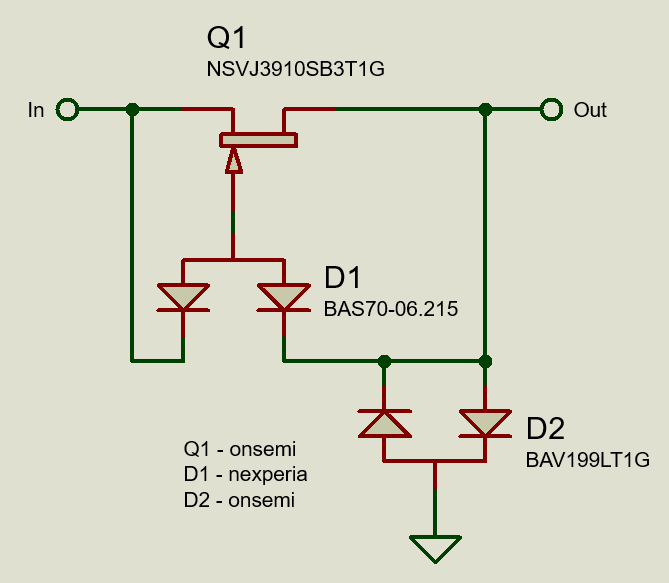
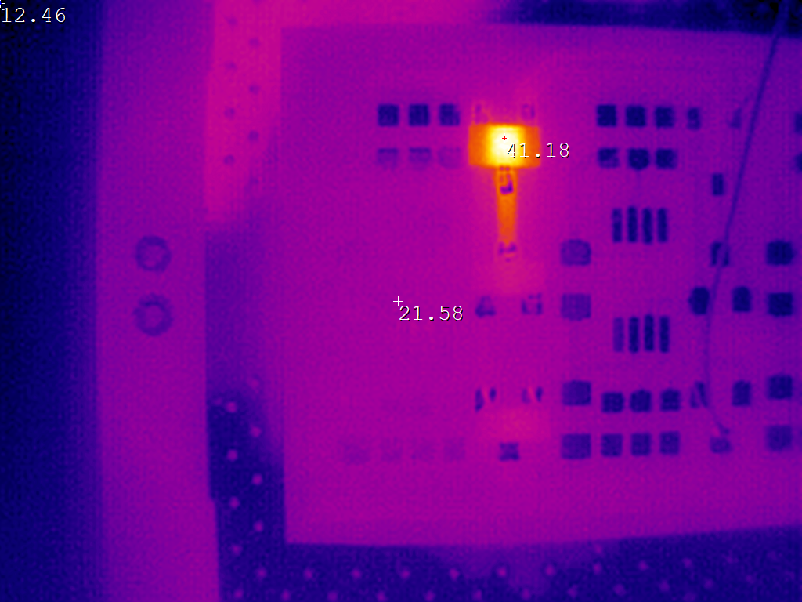
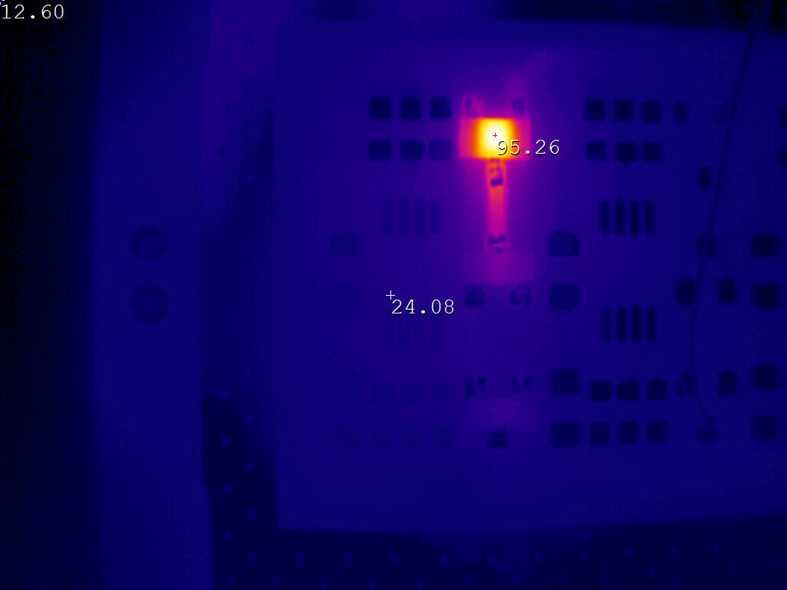

# Low noise input protection

When trying to protect noise sensitive inputs (like nanovolt amplifiers), it can be tricky to protect against continuous voltage without introducing noise (e.g. from a 50k input resistor). GDT + MOV remain suitable for protection against ESD.

In this protection circuit, a JFET is used as a constant current limiter. Leakage through D1 to the JFET ensures proper operation. D2 clamps the output voltage to +/- 1 diode drop. The maximum protection voltage is limited by the rating of the JFET (25V in this case) and careful selection of the JFET is required to not introduce additional noise.

Behaviour:
10V input = 24mA current, 0.87V on output.
25V input = 33mA current, 0.88V on output.

10V input JFET temperature:

25V input JFET temperature:

