# Keithley 428 teardown

## Overall

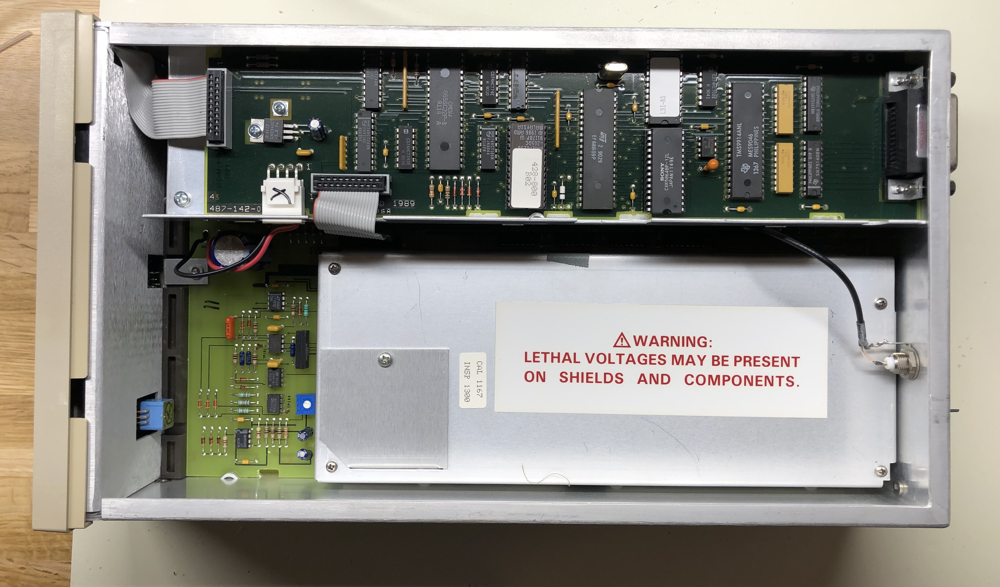

## Top left

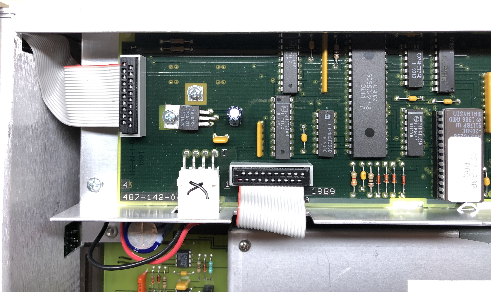

## Top right

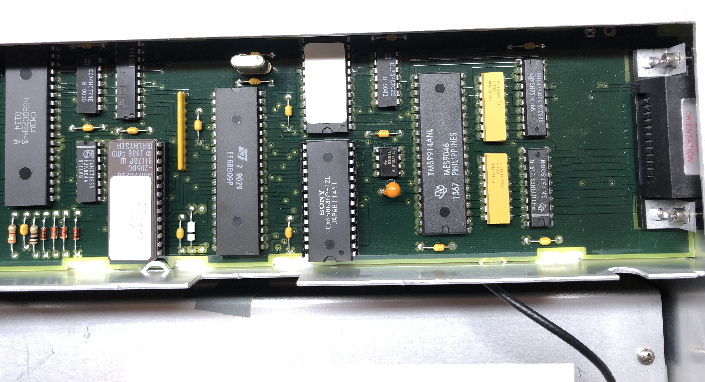

## Bottom left

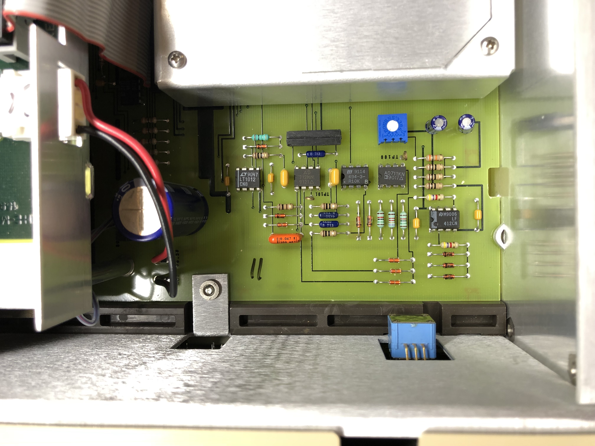

## The adjustment area

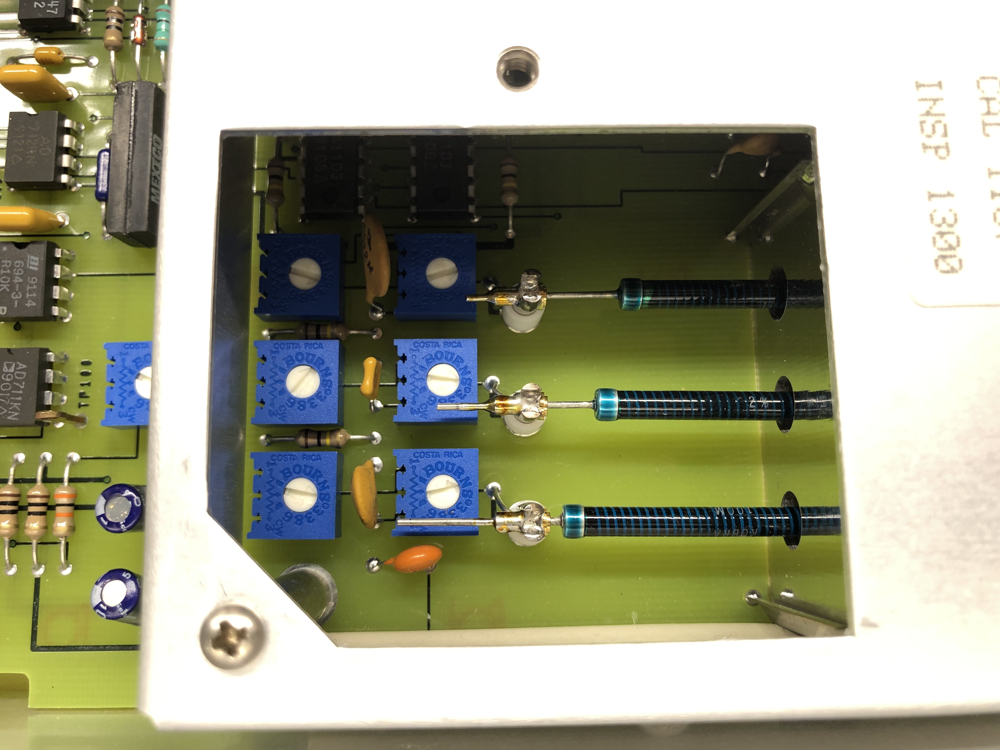

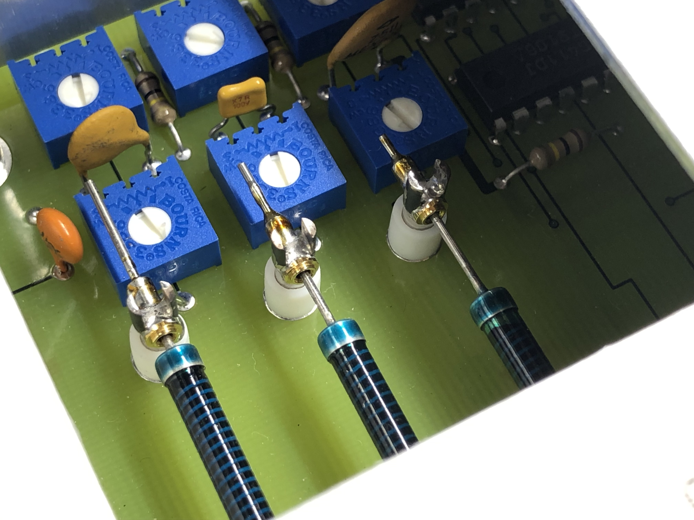

## Under the cover

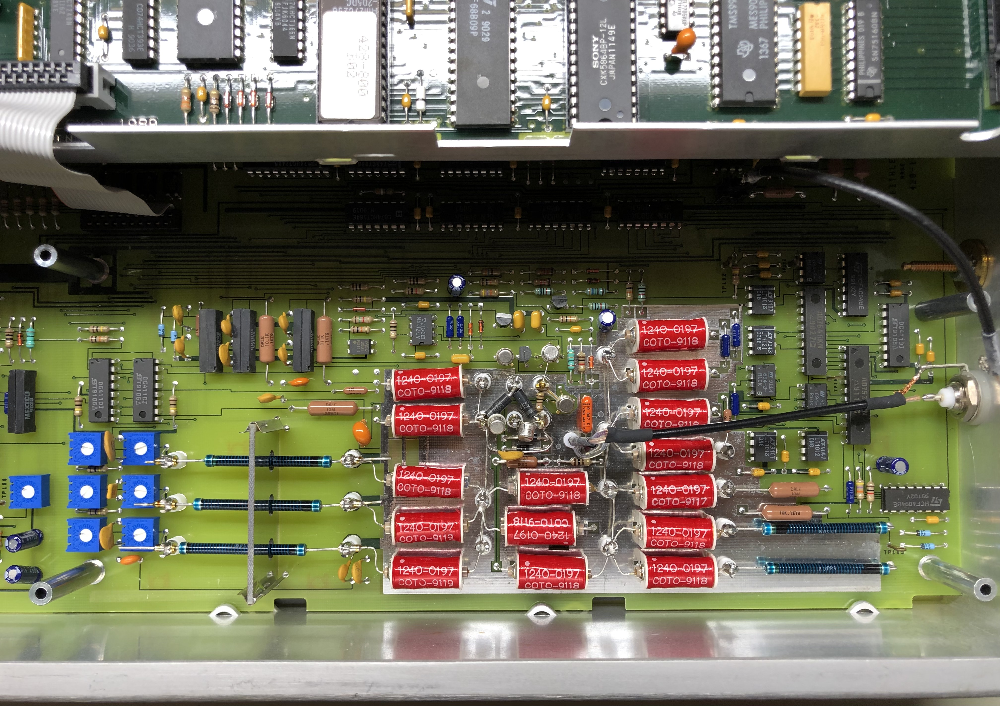

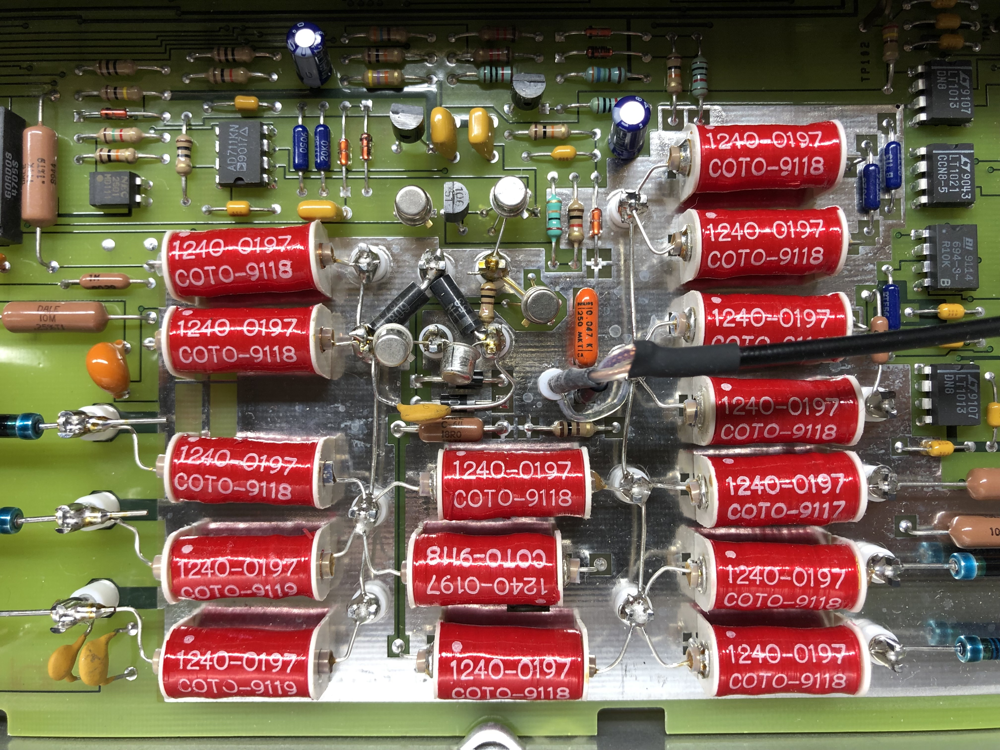

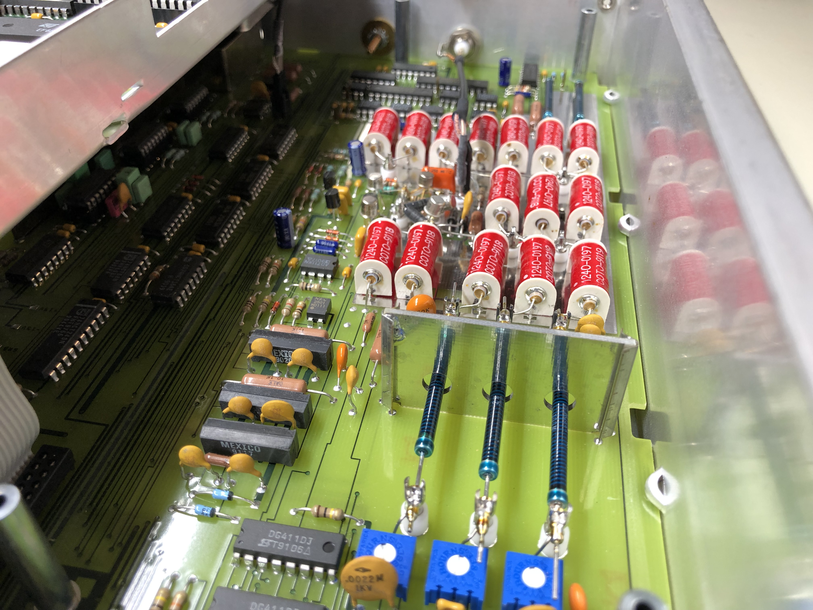

## Under the mezzanine

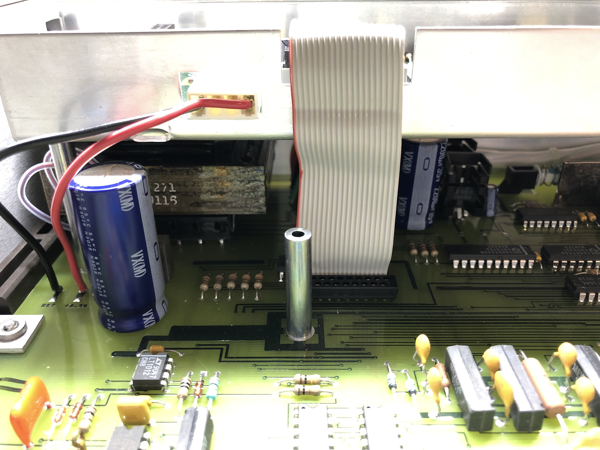

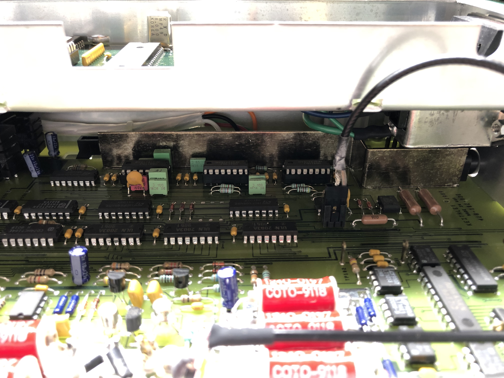

## Bottom

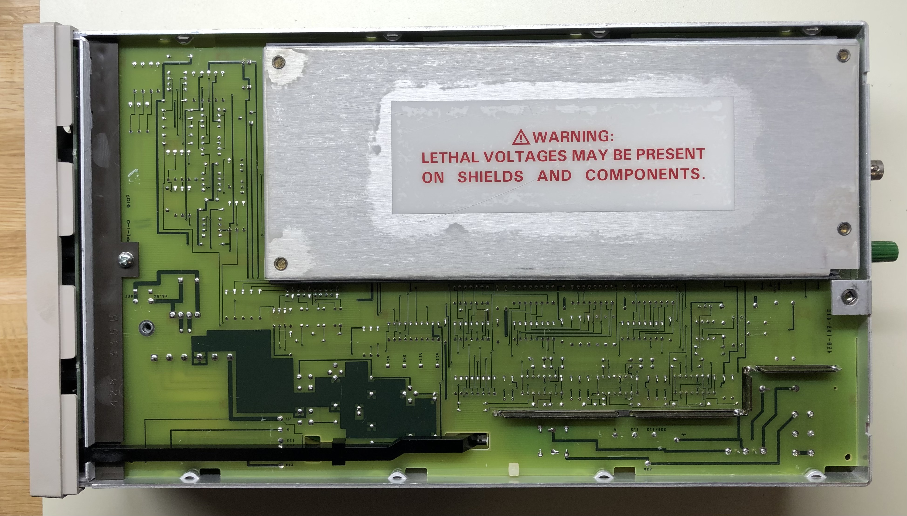

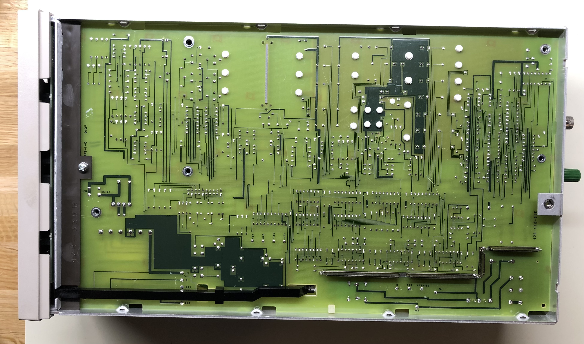

## Front wall

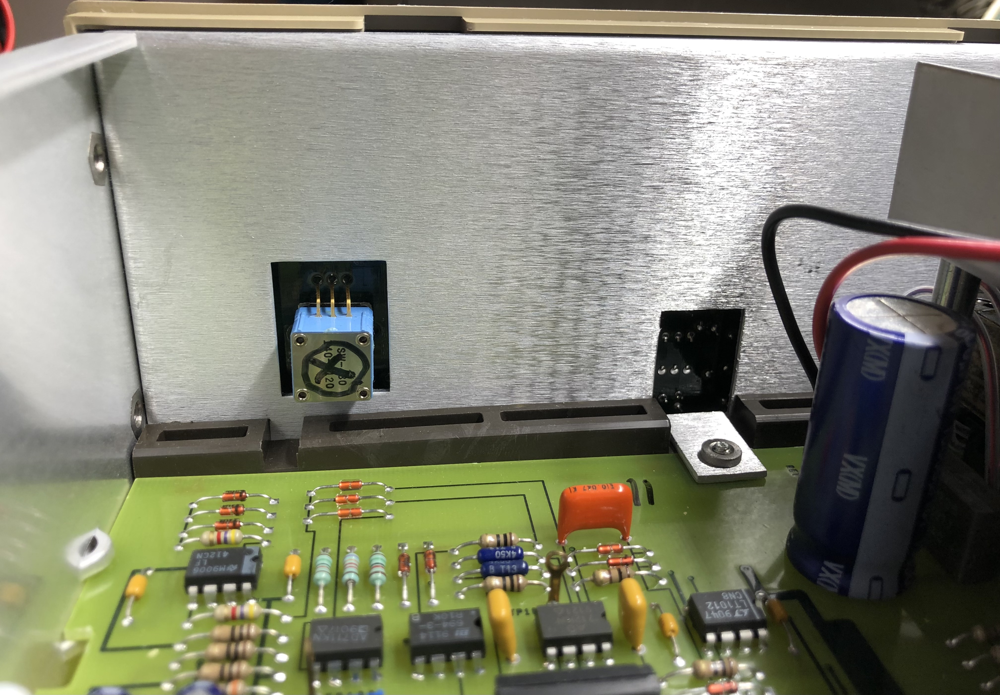

## Back wall

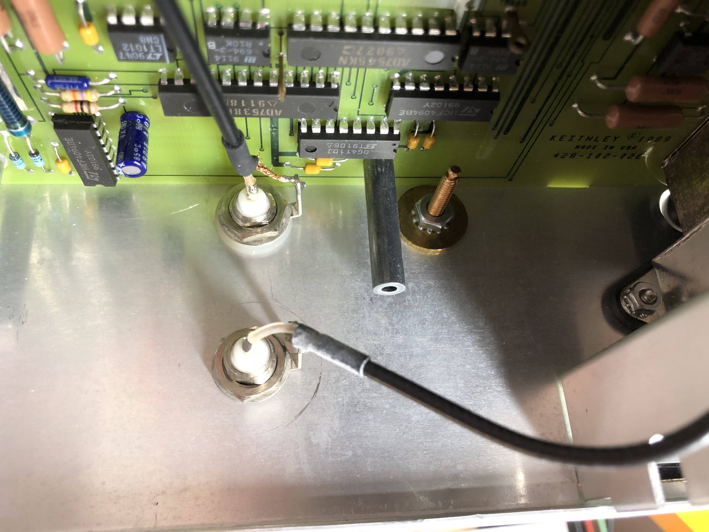